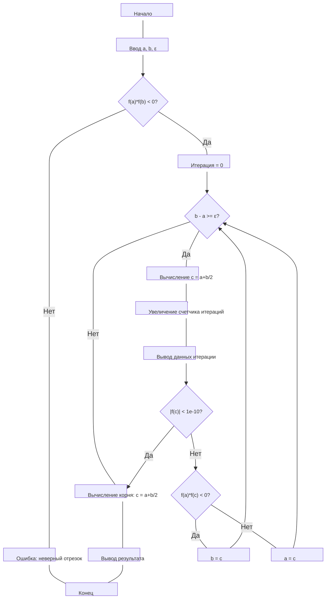

**ВАРИАНТ 1**

**Название:** Приближённое решение уравнения вида f(x) = 0 методом половинного деления.

**Цель:** Изучение метода половинного деления для решения нелинейных уравнений.

## 2. Постановка задачи

**Вариант 1:** Решить уравнение  
$x - sin x = 0.75$
с точностью $ε = 0.01.$

## 3. Выведенные вспомогательные формулы и функции

Исходное уравнение:  
$f(x) = x - sin x - 0.75 = 0$

Производные функции:
- $f'(x) = 1 - cos x$
- $f''(x) = sin x$

Для применения метода половинного деления необходимо:
1. $f(x)$ непрерывна на $[a, b]$
2. $f(a) · f(b) < 0$
3. $f'(x)$ сохраняет знак на $[a, b]$
4. $f''(x)$ сохраняет знак на $[a, b]$

## 4. Таблицы с результатами расчётов

### Отделение корней

Анализ функции $f(x) = x - sin x - 0.75:$

| x   | f(x)    |
| --- | ------- |
| 1.0 | -0.5915 |
| 1.5 | -0.2475 |
| 2.0 | 0.3407  |

Выбран отрезок $[1.5, 2.0]$, так как $f(1.5) < 0$ и $f(2.0) > 0$.

### Метод половинного деления

| Итерация | a        | b        | c        | f(a)    | f(b)   | f(c)    | Длина отрезка |
| -------- | -------- | -------- | -------- | ------- | ------ | ------- | ------------- |
| 1        | 1.500000 | 2.000000 | 1.750000 | -0.2475 | 0.3407 | 0.1199  | 0.500000      |
| 2        | 1.500000 | 1.750000 | 1.625000 | -0.2475 | 0.1199 | -0.0468 | 0.250000      |
| 3        | 1.625000 | 1.750000 | 1.687500 | -0.0468 | 0.1199 | 0.0392  | 0.125000      |
| 4        | 1.625000 | 1.687500 | 1.656250 | -0.0468 | 0.0392 | -0.0031 | 0.062500      |
| 5        | 1.656250 | 1.687500 | 1.671875 | -0.0031 | 0.0392 | 0.0183  | 0.031250      |
| 6        | 1.656250 | 1.671875 | 1.664063 | -0.0031 | 0.0183 | 0.0077  | 0.015625      |
| 7        | 1.656250 | 1.664063 | 1.660156 | -0.0031 | 0.0077 | 0.0023  | 0.007813      |

**Приближённое значение корня:** $x ≈ 1.660156$

## 5. Точное решение

Точное аналитическое решение уравнения $x - sin x = 0.75$ не выражается в элементарных функциях. Численное решение с высокой точностью: $x ≈ 1.6602$

## 6. Анализ полученных результатов и выводы

Метод половинного деления успешно применён для решения уравнения $x - sin x = 0.75$. За 7 итераций получено значение корня $x ≈ 1.660156$ с точностью $0.007813$, что удовлетворяет заданной точности $ε = 0.01$.

**Вывод:** Метод половинного деления является простым и надежным способом нахождения корней непрерывных функций на отрезке, где функция меняет знак.

## Листинг программы на Python

```python
import math
import matplotlib.pyplot as plt
import numpy as np

def f(x):
    return x - math.sin(x) - 0.75

def bisection_method(a, b, epsilon):
    if f(a) * f(b) >= 0:
        raise ValueError("Условие f(a)*f(b) < 0 не выполнено")
    
    iterations = []
    iter_count = 0
    
    print("Итерация |    a    |    b    |    c    |   f(c)   | Длина отрезка")
    print("---------|---------|---------|---------|----------|--------------")
    
    while (b - a) >= epsilon:
        c = (a + b) / 2
        iter_count += 1
        
        # Сохраняем данные итерации
        iterations.append({
            'iteration': iter_count,
            'a': a,
            'b': b,
            'c': c,
            'f(c)': f(c),
            'interval_length': b - a
        })
        
        print(f"{iter_count:8} | {a:.6f} | {b:.6f} | {c:.6f} | {f(c):.6f} | {b-a:.6f}")
        
        if abs(f(c)) < 1e-10:
            break
        if f(a) * f(c) < 0:
            b = c
        else:
            a = c
    
    root = (a + b) / 2
    return root, iterations

def plot_function():
    """Построение графика функции"""
    x = np.linspace(1.4, 2.1, 400)
    y = x - np.sin(x) - 0.75
    
    plt.figure(figsize=(10, 6))
    plt.plot(x, y, 'b-', linewidth=2, label='f(x) = x - sin(x) - 0.75')
    plt.axhline(0, color='red', linestyle='--', alpha=0.7, label='y = 0')
    plt.axvline(1.6602, color='green', linestyle=':', alpha=0.7, label='Точный корень ≈ 1.6602')
    
    plt.xlabel('x')
    plt.ylabel('f(x)')
    plt.title('График функции f(x) = x - sin(x) - 0.75')
    plt.grid(True, alpha=0.3)
    plt.legend()
    plt.show()

def plot_convergence(iterations):
    """Построение графиков сходимости"""
    fig, (ax1, ax2) = plt.subplots(1, 2, figsize=(15, 6))
    
    # График длины интервала
    iterations_num = [iter_data['iteration'] for iter_data in iterations]
    interval_lengths = [iter_data['interval_length'] for iter_data in iterations]
    
    ax1.plot(iterations_num, interval_lengths, 'bo-', linewidth=2, markersize=6)
    ax1.set_xlabel('Номер итерации')
    ax1.set_ylabel('Длина интервала')
    ax1.set_title('Сходимость метода: длина интервала')
    ax1.grid(True, alpha=0.3)
    ax1.set_yscale('log')  # Логарифмическая шкала для лучшей визуализации
    
    # График значения функции в точке c
    f_values = [abs(iter_data['f(c)']) for iter_data in iterations]
    
    ax2.plot(iterations_num, f_values, 'ro-', linewidth=2, markersize=6)
    ax2.set_xlabel('Номер итерации')
    ax2.set_ylabel('|f(c)|')
    ax2.set_title('Сходимость метода: значение функции')
    ax2.grid(True, alpha=0.3)
    ax2.set_yscale('log')
    
    plt.tight_layout()
    plt.show()

def plot_iteration_steps(iterations):
    """Визуализация шагов метода"""
    x = np.linspace(1.5, 2.0, 400)
    y = x - np.sin(x) - 0.75
    
    plt.figure(figsize=(12, 8))
    plt.plot(x, y, 'b-', linewidth=2, label='f(x) = x - sin(x) - 0.75')
    plt.axhline(0, color='red', linestyle='--', alpha=0.7)
    
    colors = plt.cm.viridis(np.linspace(0, 1, len(iterations)))
    
    for i, iter_data in enumerate(iterations):
        a, b, c = iter_data['a'], iter_data['b'], iter_data['c']
        plt.axvline(a, color=colors[i], linestyle=':', alpha=0.5)
        plt.axvline(b, color=colors[i], linestyle=':', alpha=0.5)
        plt.axvline(c, color=colors[i], linestyle='-', alpha=0.8, 
                   label=f'Итер.{iter_data["iteration"]}: c={c:.4f}')
    
    plt.xlabel('x')
    plt.ylabel('f(x)')
    plt.title('Визуализация шагов метода половинного деления')
    plt.grid(True, alpha=0.3)
    plt.legend(bbox_to_anchor=(1.05, 1), loc='upper left')
    plt.tight_layout()
    plt.show()

# Основная программа
if __name__ == "__main__":
    # Начальный отрезок и точность
    a = 1.5
    b = 2.0
    epsilon = 0.01

    print("Решение уравнения x - sin(x) = 0.75")
    print(f"Отрезок: [{a}, {b}]")
    print(f"Точность: {epsilon}\n")

    # Выполнение метода
    root, iterations = bisection_method(a, b, epsilon)
    
    print(f"\nПриближённый корень: {root:.6f}")
    print(f"Значение функции в корне: {f(root):.6f}")
    print(f"Количество итераций: {len(iterations)}")
    print(f"Точное значение: ≈1.6602")
    print(f"Погрешность: {abs(root - 1.6602):.6f}")

    # Построение графиков
    print("\nСтроим графики...")
    
    # 1. График функции
    plot_function()
    
    # 2. Графики сходимости
    plot_convergence(iterations)
    
    # 3. Визуализация шагов метода
    plot_iteration_steps(iterations)
    
    # 4. Дополнительный график - сравнение с точным решением
    plt.figure(figsize=(10, 6))
    x_values = [iter_data['c'] for iter_data in iterations]
    errors = [abs(x - 1.6602) for x in x_values]
    
    plt.plot(range(1, len(errors) + 1), errors, 'go-', linewidth=2, markersize=6)
    plt.xlabel('Номер итерации')
    plt.ylabel('Абсолютная погрешность')
    plt.title('Уменьшение погрешности метода')
    plt.grid(True, alpha=0.3)
    plt.yscale('log')
    plt.show()
```

**Результат выполнения программы:**

Решение уравнения $x - sin(x) = 0.75$
Отрезок: $[1.5, 2.0]$
Точность: $0.01$

Итерация |    a    |    b    |    c    |   f(c)   | Длина отрезка
---------|---------|---------|---------|----------|--------------
       1 | 1.500000 | 2.000000 | 1.750000 | 0.119939 | 0.500000
       2 | 1.500000 | 1.750000 | 1.625000 | -0.046846 | 0.250000
       3 | 1.625000 | 1.750000 | 1.687500 | 0.039225 | 0.125000
       4 | 1.625000 | 1.687500 | 1.656250 | -0.003086 | 0.062500
       5 | 1.656250 | 1.687500 | 1.671875 | 0.018265 | 0.031250
       6 | 1.656250 | 1.671875 | 1.664063 | 0.007657 | 0.015625
       7 | 1.656250 | 1.664063 | 1.660156 | 0.002302 | 0.007812

Приближённый корень: $1.660156$
Значение функции в корне: $0.002302$ 

## Блок схема




