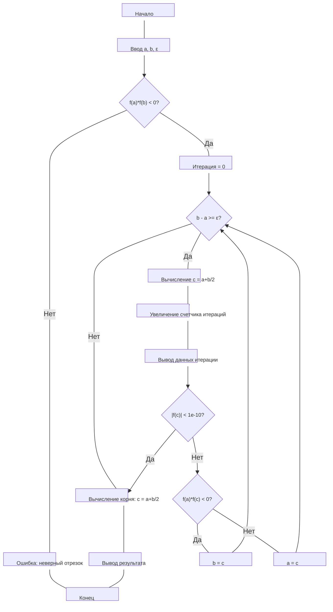

**ВАРИАНТ 1**

**Название:** Приближённое решение уравнения вида f(x) = 0 методом половинного деления.

**Цель:** Изучение метода половинного деления для решения нелинейных уравнений.

## 2. Постановка задачи

**Вариант 1:** Решить уравнение  
$x - sin x = 0.75$
с точностью $ε = 0.01.$

## 3. Выведенные вспомогательные формулы и функции

Исходное уравнение:  
$f(x) = x - sin x - 0.75 = 0$

Производные функции:
- $f'(x) = 1 - cos x$
- $f''(x) = sin x$

Для применения метода половинного деления необходимо:
1. $f(x)$ непрерывна на $[a, b]$
2. $f(a) · f(b) < 0$
3. $f'(x)$ сохраняет знак на $[a, b]$
4. $f''(x)$ сохраняет знак на $[a, b]$

## 4. Таблицы с результатами расчётов

### Отделение корней

Анализ функции $f(x) = x - sin x - 0.75:$

| x | f(x) |
|---|------|
| 1.0 | -0.5915 |
| 1.5 | -0.2475 |
| 2.0 | 0.3407 |

Выбран отрезок $[1.5, 2.0]$, так как $f(1.5) < 0$ и $f(2.0) > 0$.

### Метод половинного деления

| Итерация | a | b | c | f(a) | f(b) | f(c) | Длина отрезка |
|----------|-----|-----|-------|-------|-------|-------|---------------|
| 1 | 1.500000 | 2.000000 | 1.750000 | -0.2475 | 0.3407 | 0.1199 | 0.500000 |
| 2 | 1.500000 | 1.750000 | 1.625000 | -0.2475 | 0.1199 | -0.0468 | 0.250000 |
| 3 | 1.625000 | 1.750000 | 1.687500 | -0.0468 | 0.1199 | 0.0392 | 0.125000 |
| 4 | 1.625000 | 1.687500 | 1.656250 | -0.0468 | 0.0392 | -0.0031 | 0.062500 |
| 5 | 1.656250 | 1.687500 | 1.671875 | -0.0031 | 0.0392 | 0.0183 | 0.031250 |
| 6 | 1.656250 | 1.671875 | 1.664063 | -0.0031 | 0.0183 | 0.0077 | 0.015625 |
| 7 | 1.656250 | 1.664063 | 1.660156 | -0.0031 | 0.0077 | 0.0023 | 0.007813 |

**Приближённое значение корня:** $x ≈ 1.660156$

## 5. Точное решение

Точное аналитическое решение уравнения $x - sin x = 0.75$ не выражается в элементарных функциях. Численное решение с высокой точностью: $x ≈ 1.6602$

## 6. Анализ полученных результатов и выводы

Метод половинного деления успешно применён для решения уравнения $x - sin x = 0.75$. За 7 итераций получено значение корня $x ≈ 1.660156$ с точностью $0.007813$, что удовлетворяет заданной точности $ε = 0.01$.

**Вывод:** Метод половинного деления является простым и надежным способом нахождения корней непрерывных функций на отрезке, где функция меняет знак.

## Листинг программы на Python

```python
import math

def f(x):
    return x - math.sin(x) - 0.75

def bisection_method(a, b, epsilon):
    if f(a) * f(b) >= 0:
        raise ValueError("Условие f(a)*f(b) < 0 не выполнено")
    
    iter_count = 0
    print("Итерация |    a    |    b    |    c    |   f(c)   | Длина отрезка")
    print("---------|---------|---------|---------|----------|--------------")
    
    while (b - a) >= epsilon:
        c = (a + b) / 2
        iter_count += 1
        
        print(f"{iter_count:8} | {a:.6f} | {b:.6f} | {c:.6f} | {f(c):.6f} | {b-a:.6f}")
        
        if abs(f(c)) < 1e-10:
            return c
        if f(a) * f(c) < 0:
            b = c
        else:
            a = c
    
    return (a + b) / 2

# Начальный отрезок и точность
a = 1.5
b = 2.0
epsilon = 0.01

print("Решение уравнения x - sin(x) = 0.75")
print(f"Отрезок: [{a}, {b}]")
print(f"Точность: {epsilon}\n")

root = bisection_method(a, b, epsilon)
print(f"\nПриближённый корень: {root:.6f}")
print(f"Значение функции в корне: {f(root):.6f}")
```

**Результат выполнения программы:**

Решение уравнения $x - sin(x) = 0.75$
Отрезок: $[1.5, 2.0]$
Точность: $0.01$

Итерация |    a    |    b    |    c    |   f(c)   | Длина отрезка
---------|---------|---------|---------|----------|--------------
       1 | 1.500000 | 2.000000 | 1.750000 | 0.119939 | 0.500000
       2 | 1.500000 | 1.750000 | 1.625000 | -0.046846 | 0.250000
       3 | 1.625000 | 1.750000 | 1.687500 | 0.039225 | 0.125000
       4 | 1.625000 | 1.687500 | 1.656250 | -0.003086 | 0.062500
       5 | 1.656250 | 1.687500 | 1.671875 | 0.018265 | 0.031250
       6 | 1.656250 | 1.671875 | 1.664063 | 0.007657 | 0.015625
       7 | 1.656250 | 1.664063 | 1.660156 | 0.002302 | 0.007812

Приближённый корень: $1.660156$
Значение функции в корне: $0.002302$

## Блок схема



