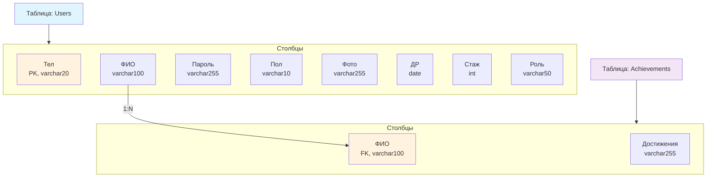
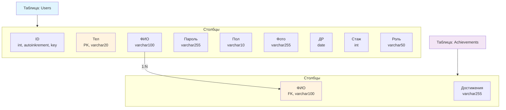

Предметная область:
Программа для составления финтнес-расписания, в которой есть пользователи:
- Администратор
- Клиенты
- Тренеры

Клиент:
- Может выбирать тренера
- Может отправить заявку на любого тренера
- Может видеть свои заявки
- Имеет план тренировок
- Может иметь тренера
- Может иметь процент прохождения комплекса тренировок

Тренер:
- Может принимать или отклонять заявки клиентов
- Может выстраивать план тренировки для клиента
- Может иметь клиентов и смотреть их список

Администратор:
- Управляет всем

Таблица "Пользователь" и "Достижения"

Приводим ко второй нормальной форме, добавляем id

